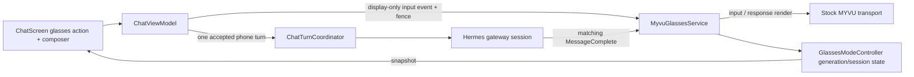

# Glasses Chat Affordance and Bidirectional Mirroring - Plan

## Goal Capsule

- **Objective:** Make glasses mode an obvious, persistent extension of the normal chat screen: a glasses icon beside New Chat attaches or switches the visible chat, clearly indicates when that chat is routed to MYVU, leaves the phone chat fully usable, mirrors phone-issued chat content and every matching response to the glasses, and removes the fork update banner.
- **Authority:** `ChatTurnCoordinator` remains the only mobile submission/persistence authority. `GlassesModeController` remains the generation/session/stream authority. Display mirroring is a fenced edge effect and never submits or persists a second turn.
- **Baseline:** The merged `com.m57.hermescontrol` personal fork already owns MYVU stock transport, direct SCO capture, active-chat switching, response rendering, readability settings, and an STT-only host sidecar.
- **Repositories:** Android-only change in this repository. No Hermes server, stock MYVU app, or host sidecar contract change is expected.
- **Execution:** Autonomous implementation, device smoke without user display confirmation, and the full local plus GitHub CI matrix.

## Product Contract

### Problem Frame

The first glasses-mode release proves the transport and conversation lifecycle, but the chat UI still presents glasses as a microphone action separated from New Chat. It does not distinguish “this chat is on the glasses” at a glance, and phone text is committed to Hermes without displaying the user turn on the glasses. Slash-command paths can also bypass the phone-priority/mirroring lifecycle. A release notice remains prominent even though this installation is a separately signed personal fork.

The follow-up must make the existing chat screen the complete control surface. Connecting glasses must not replace, disable, obscure, or navigate away from the chat. The phone composer must continue to behave normally while its visible user turns and all matching completed responses are mirrored to the currently attached glasses chat.

### Requirements

- **R1 — Dedicated placement:** Render a pair-of-glasses action immediately beside the New Chat `+` action in the chat top bar. Search may remain, but it must not separate the glasses and New Chat actions.
- **R2 — Connected indication:** When the visible chat is the active glasses chat and transport has completed startup, expose connected state through both a theme-safe semantic success treatment and a non-color accessibility cue. `STARTING`, `SUSPENDED`, `ERROR`, and another active chat must not be mislabeled connected.
- **R3 — Existing chat stays usable:** Connecting or managing glasses must not replace the chat surface. The message list, composer, attachments, slash commands, search, drawer, and New Chat remain accessible under their existing WebSocket/turn rules.
- **R4 — Immediate attach/switch:** Inactive action attaches the visible eligible chat. If another chat is active on glasses, tapping the icon on an eligible visible chat switches immediately using the existing generation-fenced service start. Tapping the icon on the current active chat opens the compact status/readability/End sheet.
- **R5 — Phone input mirroring:** Once the visible chat is connected, every user-authored phone submission that enters Hermes for that chat is displayed on the glasses exactly once. Mirror the user-visible message text, not generated attachment transport directives or internal slash plumbing.
- **R6 — Response mirroring:** Every completed Hermes response corresponding to the connected chat is displayed exactly once, whether the initiating turn came from glasses voice, ordinary phone text, attachments, or a server-backed slash-command path.
- **R7 — Single authority:** Mirroring never calls gateway submit/redirect, persists a second Room row, creates an extra lease, or changes response correlation. It uses the already accepted phone/voice turn and generation/session fence.
- **R8 — Stale safety:** Input or response mirror work from a prior generation, prior stored/runtime session, stopped mode, or previous service switch is rejected without changing display or listening state.
- **R9 — Failure recovery:** If a phone submission is rejected or fails after claiming phone priority, restore the matching glasses session to listening or an explicit suspended/error state. Do not leave capture silently stopped.
- **R10 — Session-owned collectors:** Stop/switch cancels the prior session's WebSocket and snapshot collectors so repeated chat switches cannot accumulate observers or duplicate renders.
- **R11 — Remove fork banner:** Remove the chat-screen upstream update banner and its orphaned UI resources. Retain manual About/release-note metadata only if it has another active surface; do not reintroduce upstream APK installation.
- **R12 — Full verification:** Run ktlint, color-literal guard, Android lint, JVM tests, debug/release compilation, the complete connected Android suite, signed release packaging when configured, and every GitHub CI check to a decided green state.

### Acceptance Examples

- **AE1:** Given a completed chat with inactive glasses, the top bar shows Search, a glasses icon, and New Chat with glasses immediately adjacent to `+`; tapping glasses starts the normal permission/service flow without leaving Chat.
- **AE2:** Given the visible chat is listening on glasses, the glasses action has a success-colored connected treatment plus a connected semantic label/indicator; the composer remains enabled and sends normally.
- **AE3:** Given glasses are attached to chat A while chat B is visible and eligible, chat B's glasses icon indicates switch rather than connected; tapping it switches to B and no late A input/response is displayed.
- **AE4:** Given connected chat B and a phone text submission, the exact visible user text appears on glasses once, one optimistic user message is visible, exactly one Room row is persisted after the existing coordinator accepts the turn, and one gateway turn is submitted.
- **AE5:** Given a phone submission with attachments, glasses display the visible prompt rather than generated `@file:` or upload directives; the matching completed response is also displayed once.
- **AE6:** Given a server-backed slash command that produces a Hermes response, the visible command/user turn enters the same phone-priority fence and the completed response appears on glasses. Purely local UI commands that do not create a Hermes turn do not invent a response.
- **AE7:** Given a rejected phone coordinator outcome or failed submit, capture does not remain indefinitely in `PHONE_PRIORITY`; state returns to listening or shows a concrete failure.
- **AE8:** Given repeated A→B→A switches, only the current session's collectors render; stale callbacks are ignored and no duplicate response appears.
- **AE9:** Given an upstream release is available, Chat renders no update banner. About may still expose a manual rebase/release-notes check if retained by existing settings behavior.
- **AE10:** Given connected glasses, the user can still scroll, search, attach files, type, send, open New Chat, and manage glasses from the same chat screen.

### Scope Boundaries

#### Included

- Chat top-bar glasses affordance, ordering, semantics, and state styling.
- Compact mode sheet status/readability/End behavior already established by the first release.
- Display-only phone input mirroring and complete-response mirroring for the active chat.
- Turn failure recovery and per-session collector ownership required to keep chat usable.
- Removal of the chat update banner and orphaned banner-only code/resources.
- Automated unit, Compose, connected, release, and GitHub CI verification.

#### Outside scope

- Replacing or modifying the stock MYVU application.
- Host STT/audio protocol changes.
- Streaming token-by-token assistant text to glasses; completed response mirroring remains the contract.
- Persisting plaintext dashboard credentials or changing server authentication.
- A separate glasses workspace, navigation destination, or full-screen connected-mode UI.
- Reintroducing an upstream APK self-installer.

## Planning Contract

### Key Technical Decisions

- **KTD1 — Pair-of-glasses icon beside New Chat.** (session-settled: user-directed — chosen over retaining the microphone icon before Search: glasses are a chat attachment/mode, and adjacency to `+` makes that relationship discoverable.) Use an existing Material extended eyewear/glasses vector; add no asset or dependency unless no appropriate vector exists.
- **KTD2 — Chat remains the active workspace.** (session-settled: user-directed — chosen over a modal takeover or dedicated glasses screen: the phone chat must remain accessible and usable while glasses are connected.) The mode sheet is transient management only.
- **KTD3 — Connected state on the chat's glasses icon.** (session-settled: user-directed — chosen over a global opaque status: the user needs to know which chat is routed.) Use `LocalHermesStatusColors.current.success` plus a connected content description/badge/check cue so monochrome themes and accessibility do not rely on color alone.
- **KTD4 — Mirror both phone turns and responses.** (session-settled: user-directed — chosen over voice-only mirroring: the glasses must stay synchronized with commands issued from the chat box.) Mirroring is display-only and carries generation plus stored/runtime session identity.
- **KTD5 — Preserve one turn authority.** (session-settled: user-approved — chosen over a second display submission pipeline: duplicated submit/persist behavior would split history and defeat existing arbitration.) Extend controller/service edge effects around accepted coordinator outcomes.
- **KTD6 — Remove the chat banner, not the fork boundary.** (session-settled: user-directed — chosen over continuing a prominent upstream release prompt: this installation follows a personal signing/update flow.) Delete the Chat banner surface and banner-only resources; keep manual About release notes only when still used.
- **KTD7 — Autonomous proof with full CI.** (session-settled: user-directed — chosen over user-assisted display confirmation or skipped checks: the requested run is hands-off and CI-complete.) Device proof may use accessibility state, service state, logs, and transport operations without asking the user to inspect the display.

### High-Level Design



The controller remains authoritative for whether the visible chat is connected and whether a mirror is current. The service owns per-session collectors and transport rendering. `ChatViewModel` snapshots the visible message and only emits a mirror after the coordinator accepts the phone turn; rejected submissions explicitly recover controller state.

### Existing Patterns to Reuse

- `app/src/main/java/com/m57/hermescontrol/ui/chat/ChatScreen.kt` — top-bar actions, permission launcher, mode sheet, composer.
- `app/src/main/java/com/m57/hermescontrol/glasses/GlassesModeController.kt` — generation/session/stream state and phone-priority transitions.
- `app/src/main/java/com/m57/hermescontrol/glasses/ChatTurnCoordinator.kt` — one process-scoped submit/persist lease.
- `app/src/main/java/com/m57/hermescontrol/glasses/service/MyvuGlassesService.kt` — stock transport, per-session rendering, response completion, switch/end lifecycle.
- `app/src/main/java/com/m57/hermescontrol/glasses/myvu/MyvuDisplayRenderer.kt` — pure display command policy and readability.
- `app/src/main/java/com/m57/hermescontrol/theme/HermesStatusColors.kt` and `app/src/main/java/com/m57/hermescontrol/ui/channels/components/PlatformCard.kt` — semantic success plus non-color connected status.
- `app/src/main/java/com/m57/hermescontrol/ui/chat/components/ChatComposer.kt` — existing connected-only enable/send behavior that must remain unchanged by glasses state.

### Risks and Mitigations

- **Phone mirror races a switch:** require generation and stored/runtime session match at emit and consume; cancel old collectors on switch.
- **Mirroring duplicates a turn:** emit only after the existing coordinator outcome is accepted; service render has no gateway/store dependency.
- **Slash commands have mixed semantics:** classify commands by whether they create a server turn; mirror only user-authored/server-backed paths.
- **Phone-priority rejection strands capture:** add an explicit controller rollback/suspend transition and tests for rejected/failed outcomes.
- **Connected tint is misleading:** map only transport-established active phases to connected; show starting/suspended/error separately.
- **Long attachment markup leaks to glasses:** mirror the visible prompt captured before attachment directives are appended.
- **Collector accumulation duplicates output:** own collectors under a per-session job canceled by `stopSession` before generation advances.
- **Banner cleanup removes About behavior:** delete only the chat composition and banner-only component/resources unless reference analysis proves the launch checker has no remaining consumer.

## Implementation Units

### U1. Replace the top-bar microphone affordance with connected glasses state

- **Goal:** Make glasses attachment and ownership obvious without reducing chat usability.
- **Requirements:** R1-R4, R11; AE1-AE3, AE9-AE10
- **Files:** `app/src/main/java/com/m57/hermescontrol/ui/chat/ChatScreen.kt`; `app/src/main/res/values/strings.xml`; localized string files; delete `app/src/main/java/com/m57/hermescontrol/ui/common/UpdateNoticeBanner.kt` if orphaned; Compose tests under `app/src/androidTest/java/com/m57/hermescontrol/ui/chat/ChatScreenTest.kt`.
- **Approach:** Reorder actions so Search → glasses → New Chat (glasses immediately beside `+`). Replace `Icons.Filled.Mic` with a glasses/eyewear vector. Derive inactive/switch/starting/connected/suspended/error semantics from the current snapshot and visible stored session. Treat `LISTENING`, `TRANSCRIBING`, `AWAITING_HERMES`, `RENDERING`, and `PHONE_PRIORITY` as connected only for the current active chat; apply success color plus a semantic connected cue in those states. Treat `INACTIVE`, `STARTING`, `SUSPENDED`, and `ERROR` as their named non-connected states. Keep current-chat tap opening the sheet and other-chat tap switching. Remove the chat update cache/banner composition and banner-only resources.
- **Tests:** Assert action order and semantics; inactive/start, every established connected phase, current connected/manage, other-chat/switch, suspended, and error labels/treatment; composer/send remains enabled in active connected state; no update banner under forced available-update state; sheet status is human-readable and existing End/font/pacing controls remain.

### U2. Add generation-fenced phone-input display mirroring

- **Goal:** Show each accepted phone-authored turn on the currently connected glasses chat exactly once without changing submission authority.
- **Requirements:** R5, R7-R9; AE4-AE7
- **Files:** `app/src/main/java/com/m57/hermescontrol/glasses/GlassesModeController.kt`; `app/src/main/java/com/m57/hermescontrol/ui/chat/ChatViewModel.kt`; `app/src/main/java/com/m57/hermescontrol/glasses/service/MyvuGlassesService.kt`; `app/src/main/java/com/m57/hermescontrol/glasses/myvu/MyvuDisplayRenderer.kt`; corresponding JVM tests.
- **Approach:** Introduce an unexported `MyvuGlassesService` action carrying a display-only phone-mirror payload: generation, stored/runtime session IDs, and visible text. Emit it only after the coordinator accepts the phone/attachment/server-backed command turn. The service validates the payload through the controller before rendering a dedicated user/input kind through the active document policy. Reject stale/nonmatching commands after switch/end. On a rejected outcome or a thrown coordinator submission failure after phone priority is claimed, roll phone-priority state back to listening or explicit suspension without creating a render.
- **Tests:** Normal text mirrors once through the service action; attachment mirror excludes generated directives; no duplicate gateway/store operations; stale generation/session action rejected after switch/end; rejected and thrown submit failures restore state; purely local slash commands do not fabricate a Hermes turn; server-backed slash command takes phone priority and mirrors once.

### U3. Make response mirroring and service collectors complete across phone paths

- **Goal:** Render every matching completed response while keeping one current service session and reusable phone chat.
- **Requirements:** R3, R6, R8-R10; AE3, AE6, AE8, AE10
- **Files:** `app/src/main/java/com/m57/hermescontrol/glasses/service/MyvuGlassesService.kt`; `app/src/main/java/com/m57/hermescontrol/glasses/GlassesModeController.kt`; service/controller/ViewModel tests.
- **Approach:** Replace service-wide accumulating collectors with one per-session child job canceled on stop/switch. Use an explicit response-source matrix: prompt-producing ordinary/attachment/`send`/`skill` paths mirror their matching `MessageComplete`; server-backed `command.dispatch` and `slash.exec` terminal output uses the same fenced display-only response action; locally generated usage, feedback, and unsupported-command text never mirrors. Correlate every response through the current controller fence, render once, then reopen listening only for the matching session. Preserve chat screen state and composer availability throughout. Ensure switch tears down A collectors before starting B.
- **Tests:** A→B→A switches produce one current collector/render; stale A terminal cannot display on B; ordinary text, attachment, voice, `send`/`skill` `MessageComplete`, `command.dispatch`, and `slash.exec` responses each render exactly once; local command/no-turn/usage output produces none; End cancels collectors and leaves chat/history usable.

### U4. Remove the fork banner and run the full release/CI contract

- **Goal:** Ship the follow-up as a reviewed personal-fork update with no chat update banner.
- **Requirements:** R11-R12; AE9
- **Files:** update/banner references discovered in U1; focused tests; no host files.
- **Approach:** Confirm no orphan banner imports/resources remain, retain only still-used manual About metadata, then run the complete verification matrix, simplify, review/fix, commit, push, open a PR, and babysit every GitHub check to green.
- **Tests:** Full JVM and connected suites; release compilation and signed packaging when configured; fresh app launch with available upstream release shows no Chat banner; existing About behavior remains if retained.

## Verification Contract

From repository root:

```bash
./gradlew ktlintCheck checkColorLiterals lintDebug testDebugUnitTest assembleDebug compileReleaseKotlin
./gradlew connectedDebugAndroidTest --no-daemon
```

Focused development gates:

```bash
./gradlew testDebugUnitTest \
  --tests 'com.m57.hermescontrol.glasses.*' \
  --tests 'com.m57.hermescontrol.ui.chat.ChatViewModelTest'
```

Signed personal release gate when `~/.config/hermes-mobile/release.env` is available:

```bash
bash -c 'set -a; . ~/.config/hermes-mobile/release.env; set +a; exec ./gradlew assembleRelease -PupstreamVersionName=1.23.1 -PupstreamVersionCode=1231 -PpersonalRevision=2'
```

Inspect package ID, version, and signer with `apkanalyzer` and `apksigner`. Install the final signed APK, drive the chat and glasses controls through the real Android UI, verify service/transport/log state, issue a phone composer prompt autonomously, observe input/response transport sends, switch chats, and end mode. No user display confirmation is required.

GitHub CI must finish green for ktlint/color guard, Android lint, JVM tests, debug build, release compile, instrumented tests, CodeQL, conflict detection, and the CI summary. A failing instrumented job is fixed, never skipped.

## Definition of Done

- A pair-of-glasses icon is immediately beside New Chat.
- The visible active glasses chat has an accessible connected indication that is not color-only.
- Chat remains fully accessible and usable while glasses are connected.
- Phone text, attachments, and server-backed command turns mirror their visible user content exactly once.
- Every matching completed response mirrors exactly once, regardless of phone or glasses origin.
- Stale switch/end callbacks cannot display or submit in the wrong chat.
- Rejected/failed phone turns do not strand capture.
- Per-session service collectors are canceled on switch/end.
- The chat update banner and banner-only resources are gone; no upstream APK installer exists.
- Focused, full JVM, connected Android, release, hardware smoke, review, and full GitHub CI gates pass.
- Changes are committed on a new branch, pushed, reviewed, and merged only through a PR.
