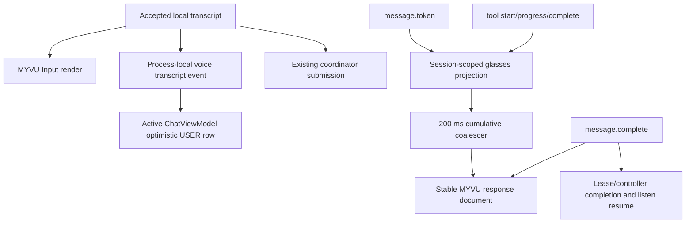
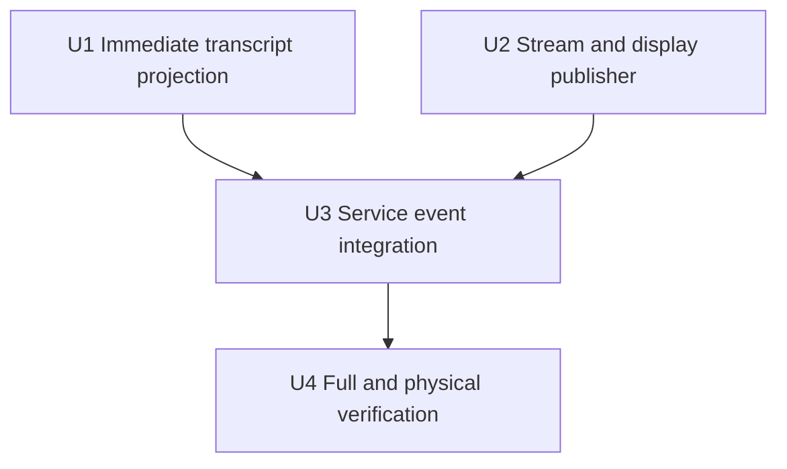

# Glasses Streaming Publishing - Plan

## Goal Capsule

- **Objective:** Publish transcribed voice input, incremental assistant tokens, and readable tool-call status to MYVU glasses without waiting for `message.complete`, while preserving the app's existing streaming UI and turn/session authority.
- **Authority hierarchy:** `GlassesModeController` remains the session and turn fence. `ChatTurnCoordinator` remains the only prompt-submission authority. `HermesWsClient` events are the streaming source. `message.complete` remains the authoritative final assistant text and the only event that completes the turn and resumes capture.
- **Execution profile:** Focused Android-only change on latest mobile `main` (`a71ad09`). No server, desktop, protocol, model, capture, or firmware change.
- **Stop conditions:** Stop rather than ship if incremental updates can cross a session/generation fence, tool content can expose raw risky output, Binder publishing cannot be bounded, final text diverges from the app, or physical MYVU updates flicker/append incorrectly instead of replacing the active response.
- **Tail ownership:** The autonomous run owns implementation, local Android gates, physical Pixel 5/MYVU verification, code review, PR creation, and CI to green.

---

## Product Contract

### Summary

The app already renders WebSocket `message.token` events incrementally, but `MyvuGlassesService` ignores them and waits for `message.complete`. The service will consume the same session-scoped token and tool events, coalesce cumulative response updates for MYVU, and replace the active response document until the final authoritative text arrives. A locally accepted speech transcript will appear on both the glasses and the active chat immediately, before prompt submission waits on the gateway acknowledgement.

### Problem Frame

Waiting for `message.complete` makes the glasses feel frozen during long answers even though the phone already shows tokens. Tool-heavy turns are worse: the user sees neither the assistant's pre-tool narration nor what tool is running. Voice input also disappears after transcription until the later server-backed chat refresh, so the user cannot immediately confirm what the model heard.

The change must not create a second chat reducer on the glasses. It needs a small projection of existing events: cumulative assistant prose, one bounded latest-tool status, and an optimistic local voice row. The phone reducer, stored transcript, and `message.complete` remain authoritative for durable history.

### Actors

- A1. **Mike** — speaks through MYVU and reads his transcript, streamed assistant prose, and tool activity without looking at the phone.
- A2. **Hermes Mobile chat** — continues its existing 33 ms token streaming and durable transcript reconciliation.
- A3. **MYVU service/display** — projects the current fenced turn to one replaceable glasses document at a lower bounded cadence.
- A4. **Hermes gateway** — emits message and tool events; no protocol change is required.

### Requirements

**Immediate voice confirmation**

- R1. Once `GlassesModeController.completeTranscript` accepts non-empty text, the service must render that text on MYVU as `DisplayKind.Input` before starting gateway submission.
- R2. The active `ChatViewModel` must append the accepted voice transcript immediately as an optimistic USER message with an ID derived from the utterance ID when stored and runtime session IDs match. Replaying one event ID is ignored, while two utterance IDs with identical text remain two turns.
- R3. Empty, stale, canceled, and exact spoken-end transcripts must publish nothing. If reserve/commit rejects or throws after optimistic publication, a matching failure event must remove that still-optimistic row and leave reconciled/server rows untouched.

**Incremental assistant publishing**

- R4. The first renderable event—non-empty `message.token` or tool transition—for the active glasses turn must begin a new MYVU response document before `message.complete`.
- R5. Later tokens must publish cumulative text into the same MYVU document, coalesced to at most one update per 200 ms. Event callbacks enqueue immutable render intents and never execute blocking Binder transactions.
- R6. Streaming applies to the matching runtime session during both voice-owned `AWAITING_HERMES` turns and existing `PHONE_PRIORITY` turns mirrored to glasses.
- R7. `message.start` activates one projection epoch; `message.complete`, mode/session replacement, service teardown, or transport loss closes it and cancels pending renders. Events received without an active epoch are ignored. Same-socket event ordering is a required gateway invariant because token/tool events carry no server turn ID.
- R8. `message.complete` must drop queued partial intents, enqueue the exact final text as the last write immediately, complete the matching lease/controller transition, and resume capture only after final display delivery.
- R9. A final response with no preceding token/tool event must retain current behavior by opening and rendering a normal response document.

**Tool visibility**

- R10. `tool.start` must immediately show the existing `ToolSchemaRegistry` icon/name. Optional call detail is limited to a glasses-specific allowlist of non-sensitive tool/key pairs, credential-redacted and capped at 240 characters; terminal commands, code, typed input, unknown tools, `args_text`, maps/lists, and generic scalar fallbacks show name/status only.
- R11. `tool.generating` and `tool.progress` must immediately update the same response document with fixed locally generated status text. Arbitrary `ToolProgress.preview` content must never be rendered on glasses.
- R12. `tool.complete` must show completion for the latest tool without raw result payloads. `tool.output_risk` must clear prior tool detail and show only a generic redacted/risk notice, never preview, findings, or output.
- R13. Tool text must compose beneath any assistant prose already streamed in the turn and remain visible until later prose or final completion replaces it.

**Compatibility and shipping**

- R14. Existing phone streaming, reasoning cards, tool bubbles, phone-priority arbitration, terminal completion, end phrases, display readability settings, and on-device STT behavior remain unchanged.
- R15. The implementation must pass full Android local gates, API 34 x86_64 instrumentation in CI, and a physical MYVU scenario that observes transcript-first, partial assistant text, tool text, exact final replacement, and listen resume.

### Key Flows

- F1. **Voice transcript appears immediately.** Local Whisper returns text; the controller accepts the exact fence; the service renders Input and emits a process-local optimistic transcript event; the active ViewModel inserts one USER row; only then does coordinator reserve/commit proceed.
- F2. **Assistant prose streams.** A matching `message.start` resets the per-turn projection. The first token opens a response document. Token bursts update the cumulative buffer, while a 200 ms trailing scheduler replaces the same document with the latest cumulative text.
- F3. **A tool interrupts prose.** Pending tokens flush into the projection. `tool.start` immediately displays assistant prose plus the formatted tool call; progress replaces the tool line; completion marks it done. Post-tool tokens continue cumulative prose, and final completion removes transient tool status by rendering authoritative final text.
- F4. **Stale work is canceled.** Mode/session/transport teardown closes the turn publisher. Pending jobs become no-ops, and later events fail session/controller-state checks.
- F5. **No token stream.** If only `message.complete` arrives, the publisher opens a normal response document with final text and current completion behavior continues.

### Acceptance Examples

- AE1. **Covers R1-R3.** Given a current listening stream, when Whisper returns `check the weather` and the controller accepts it, then the phone and glasses show that USER text before the gateway submit deferred completes; one later server row reconciles without duplication.
- AE2. **Covers R4-R5, R8.** Given a voice turn is awaiting Hermes, when tokens `Hello`, `, `, and `world` arrive over 250 ms, then MYVU first shows `Hello`, later replaces it with cumulative text using the same document key, and finally shows the exact `message.complete` payload.
- AE3. **Covers R6-R8.** Given a token update is pending, when mode ends or another runtime session becomes active, then the pending update never reaches transport.
- AE4. **Covers R10-R13.** Given `tool.start(name=web_search, query=weather)`, progress with an arbitrary preview, and completion, then the glasses show the web-search label plus redacted/allowed query, a fixed running status without preview content, and completion without raw output.
- AE5. **Covers R12.** Given secret-bearing progress arrives before `tool.output_risk(redacted=true)`, then no renderer command ever contains the secret and glasses show only a generic redacted warning.
- AE6. **Covers R9.** Given `message.complete` arrives without any preceding token or tool event, then the final response opens and renders one normal response document.
- AE7. **Covers R14-R15.** Given a physical tool-using turn, then the phone continues normal streaming/tool cards, glasses show partial prose and safe tool status before completion, final text matches, and SCO capture resumes once.

### Scope Boundaries

**In scope**

- Process-local optimistic voice transcript projection, session-scoped assistant/tool projection, MYVU document replacement, focused tests, physical verification, and CI.

**Out of scope**

- Streaming reasoning/thinking text to glasses.
- Raw tool results, full diffs, terminal stdout/stderr, risk findings, or secrets on glasses.
- Gateway protocol changes, server changes, desktop code, STT/VAD/model tuning, capture changes, persistence schema changes, or a general cross-device rendering framework.

### Dependencies and Assumptions

- `message.token`, `tool.start`, `tool.generating`, `tool.progress`, `tool.complete`, `tool.output_risk`, and `message.complete` already carry runtime session IDs.
- The stock MYVU transport replaces `part=0` content for a stable `fileKey`; physical verification is the hard gate for this vendor behavior.
- The phone ViewModel is alive when the active chat is visible. If it is not, coordinator persistence/server reconciliation remains the durable fallback when the chat reopens.

### Sources and Research

- `app/src/main/java/com/m57/hermescontrol/glasses/service/MyvuGlassesService.kt`: current complete-only rendering and local transcript submission.
- `app/src/main/java/com/m57/hermescontrol/glasses/myvu/MyvuDisplayRenderer.kt`: active document keys and `send_content` payload.
- `app/src/main/java/com/m57/hermescontrol/data/ws/WsEvent.kt` and `EventParser.kt`: existing token/tool event contracts.
- `app/src/main/java/com/m57/hermescontrol/ui/chat/ChatStreamingController.kt`: existing app-side cumulative token buffering.
- `app/src/main/java/com/m57/hermescontrol/ui/chat/ToolSchemaRegistry.kt`: canonical tool icon and summary-argument configuration.
- `app/src/main/java/com/m57/hermescontrol/ui/chat/ChatViewModel.kt`: optimistic phone USER-row pattern and logical-message dedupe.

---

## Planning Contract

### Key Technical Decisions

- KTD1. **Stream cumulative assistant text instead of waiting for completion.** (session-settled: user-directed — chosen over the current `message.complete`-only publishing: the glasses should visibly progress while the LLM generates.) Open on the first token, coalesce replacements at 200 ms, and flush the exact final payload immediately.
- KTD2. **Publish accepted speech locally before gateway submission.** (session-settled: user-directed — chosen over waiting for gateway/Room/server reconciliation: the user wants immediate confirmation of what Whisper heard on both surfaces.) Use a small process-local event for the active ViewModel and keep coordinator/server persistence authoritative.
- KTD3. **Reuse one MYVU response document per turn.** The first renderable token or tool event uses the existing full open/content/font command sequence and establishes the key; every later partial, tool, risk, and final event sends `send_content` with that key. A new `message.start` creates a new projection epoch and key.
- KTD4. **Project safe tool activity, not tool bubbles or output.** Reuse `ToolSchemaRegistry` for icon/name, then apply a glasses-specific tool/key allowlist plus credential redaction. Show fixed generating/running/completed labels; never render raw progress previews, terminal/code/input arguments, unknown-tool values, completion results, or risk findings.
- KTD5. **Keep `message.complete` authoritative.** Streaming text is transient projection. Final completion drops queued partial writes, becomes the serialized writer's last render for the epoch, completes the coordinator lease and controller state once, and remains the listen-resume boundary.
- KTD6. **Fence lifecycle and rely on ordered events explicitly.** Exact runtime session, active controller state, and an open MessageStart→MessageComplete projection epoch gate events; publisher closure/generation suppresses delayed scheduled writes. The gateway/WebSocket ordering contract is required because current token/tool events have no turn ID; adding protocol turn IDs is outside this focused change.

### High-Level Technical Design



`MyvuTurnStreamPublisher` is session-scoped and constructed by the event router. It owns the assistant buffer, safe current-tool line, document state, projection epoch, and one serialized off-Main Binder writer. Event callbacks enqueue immutable render intents and return. Ordinary partial intents are conflated to the 200 ms cadence; immediate tool/risk/final intents retain order. Final drops queued partials before enqueueing and every write rechecks publisher generation before transport.

The first visible token or tool event opens the document. `MyvuDisplayRenderer` gains a focused update method that requires an existing document key and emits only `send_content`. Existing `commandsFor` behavior stays unchanged for context, input, status, phone mirroring, and the first response.

`ChatTurnCoordinatorProvider` exposes a bounded process-local `SharedFlow<VoiceTranscriptUiEvent>` with Published and SubmissionFailed events keyed by utterance ID. The service emits Published only after controller acceptance and emits SubmissionFailed on reserve/commit rejection or exception. `ChatViewModel` injects/collects that flow, appends a stable-ID USER row only for its current stored/runtime session, ignores replayed IDs, and removes only a matching optimistic row on failure.

### Failure and Lifecycle Rules

- An empty token changes nothing.
- Renderer/transport work runs on one session-scoped off-Main writer. The WebSocket collector only mutates projection state and enqueues intents.
- A transport disconnect cancels the session scope, event router, publisher, and writer before service teardown.
- A final event invalidates queued partials and becomes the epoch's last write. It never waits for the 200 ms cadence.
- A process-local transcript event missed while the ViewModel is absent does not affect persistence; the coordinator/server path remains authoritative.
- Tool detail uses an explicit non-sensitive tool/key allowlist and credential redaction. Raw progress, maps, lists, results, commands, code, typed input, and unknown scalar fields never reach MYVU.

### Risks and Mitigations

- **Vendor content updates append or flicker.** Reuse the exact `fileKey` and `part=0` path; unit-test keys/payloads and require physical partial-to-final replacement before shipping.
- **Binder flooding or blocking.** First visible event is immediate; ordinary token updates are capped at five per second; one serialized off-Main writer preserves order and keeps the WebSocket collector responsive.
- **Stale delayed token overwrites final.** Final closes the projection epoch, drops queued partials, and becomes the writer's last accepted intent.
- **Tool payload leaks.** Only glasses-allowlisted, credential-redacted scalar details are shown. Progress is a fixed local label; risk clears detail and never displays output/findings.
- **Duplicate or false optimistic voice row.** Event replay dedupes by utterance ID, not content. A submission-failed event removes only its still-optimistic row; later reconciliation keeps repeated text as distinct turns.
- **Cross-session/turn events.** Require exact runtime session, controller state, and open projection epoch. The same-socket gateway event order is explicit; current protocol cannot identify an old event arriving after the next MessageStart on the same session.

### Sequencing



---

## Implementation Units

### U1. Publish accepted voice transcripts immediately

- **Goal:** Show the accepted local transcript on MYVU and in the active app chat before gateway submission completes.
- **Requirements:** R1-R3; AE1; KTD2
- **Flows:** F1
- **Files:** `app/src/main/java/com/m57/hermescontrol/glasses/ChatTurnCoordinatorProvider.kt`; `app/src/main/java/com/m57/hermescontrol/glasses/service/MyvuGlassesService.kt`; `app/src/main/java/com/m57/hermescontrol/ui/chat/ChatViewModel.kt`; `app/src/test/java/com/m57/hermescontrol/ui/chat/ChatViewModelTest.kt`
- **Approach:** Add a bounded Published/SubmissionFailed event flow and injectable ViewModel flow dependency. Emit/render Published synchronously after controller acceptance and before reserve/commit. Use the utterance ID as the optimistic row ID; remove only that row on failure.
- **Test Scenarios:** Current session appends before suspended gateway submission completes; wrong stored/runtime session is ignored; replayed event ID is ignored; two IDs with identical text append twice; failure removes only its optimistic ID; empty/stale/end transcripts emit nothing; service ordering is accept → glasses Input/Published → coordinator, with SubmissionFailed on rejection/exception.
- **Dependencies:** None.

### U2. Add bounded MYVU response and tool publisher

- **Goal:** Convert token/tool events into one replaceable response document without flooding Binder.
- **Requirements:** R4-R13; AE2-AE6; KTD1, KTD3-KTD6
- **Flows:** F2-F5
- **Files:** create `app/src/main/java/com/m57/hermescontrol/glasses/service/MyvuTurnStreamPublisher.kt`; create `app/src/test/java/com/m57/hermescontrol/glasses/service/MyvuTurnStreamPublisherTest.kt`; `app/src/main/java/com/m57/hermescontrol/glasses/myvu/MyvuDisplayRenderer.kt`; `app/src/test/java/com/m57/hermescontrol/glasses/myvu/MyvuDisplayRendererTest.kt`
- **Approach:** Implement a session-local projection plus one serialized off-Main Binder writer. Conflate ordinary partials, preserve immediate/final ordering, and recheck generation before each send. Reuse `ToolSchemaRegistry` for icon/name, then apply a glasses-specific safe-detail allowlist, credential redaction, fixed progress labels, and bounded strings.
- **Test Scenarios:** First token and tool-first both open one new key; burst tokens conflate at 200 ms; blocking fake transport does not block event callbacks; final drops queued partials and remains last; tool→progress→token→final keeps one key; allowed/redacted details; terminal/code/unknown values excluded; secret progress never appears before risk; close/session replacement suppresses pending; no-token final opens normally; content-only update payload.
- **Dependencies:** None.

### U3. Wire streaming events into the glasses service

- **Goal:** Replace complete-only handling with fenced transcript/token/tool/final publishing while retaining one terminal completion path.
- **Requirements:** R4-R14; AE2-AE7
- **Flows:** F2-F5
- **Files:** create `app/src/main/java/com/m57/hermescontrol/glasses/service/MyvuSessionEventRouter.kt`; create `app/src/test/java/com/m57/hermescontrol/glasses/service/MyvuSessionEventRouterTest.kt`; `app/src/main/java/com/m57/hermescontrol/glasses/service/MyvuGlassesService.kt`; `app/src/androidTest/java/com/m57/hermescontrol/glasses/service/MyvuGlassesServiceTest.kt`
- **Approach:** Keep the service as collector/lifecycle adapter and delegate event decisions to an internal router with injected publisher, current-turn snapshot, lease completion, final render, and resume callbacks. Route matching MessageStart/Token/Tool*/Risk/Complete events; reject events without an open epoch or correct session/state.
- **Test Scenarios:** Voice and PHONE_PRIORITY streams publish; other session/state events do not; tool-first and tool-with-prose work; final completes/resumes once; token before MessageStart or after final/end/transport failure is suppressed; new MessageStart creates a fresh epoch; complete-only fallback renders once.
- **Verification:** Focused router/publisher tests plus Android service declaration regression.

### U4. Prove end-to-end streaming and ship

- **Goal:** Demonstrate visible partial and tool updates on real MYVU, then land through CI.
- **Requirements:** R15; AE6
- **Files:** No expected production files beyond defects exposed by verification.
- **Approach:** Run full local gates, build/install the next signed personal revision, use a harmless tool-using prompt, and record event/display timing from first token/tool to final. Confirm phone and glasses text order and post-final listen resume.
- **Test Scenarios:** Spoken transcript appears on both surfaces before assistant starts; at least two partial response states precede final; tool name/detail and progress appear; final exactly replaces partial/tool content; one response and one resume; typed PHONE_PRIORITY turn also streams.
- **Verification:** Full Gradle gates, signed APK identity, Pixel 5/MYVU observation, and green GitHub Actions.
- **Dependencies:** U3.

---

## Verification Contract

### Focused Android gates

```bash
./gradlew testDebugUnitTest \
  --tests 'com.m57.hermescontrol.glasses.*' \
  --tests 'com.m57.hermescontrol.ui.chat.ChatViewModelTest'
```

```bash
./gradlew compileDebugAndroidTestKotlin
```

### Full Android gates

```bash
./gradlew ktlintCheck checkColorLiterals lintDebug testDebugUnitTest assembleDebug externalNativeBuildRelease compileReleaseKotlin
```

GitHub CI must pass API 34 x86_64 connected tests, packaged release ABI inspection, CodeQL, lint, unit/integration tests, and CI Summary.

### Physical MYVU gate

1. Build/install the next same-certificate personal release on Pixel 5 `09211FDD4002MJ` and confirm package/version/certificate.
2. Start a completed chat on MYVU and speak a harmless prompt that causes at least one tool call.
3. Observe the transcript on glasses and phone before gateway/assistant output.
4. Record at least two cumulative partial assistant states before final completion.
5. Observe tool name plus bounded call detail/progress; confirm no raw result or risk findings appear.
6. Confirm exact final assistant text replaces partial/tool content, one terminal response is stored/rendered, and listening resumes once.
7. Submit a typed phone prompt during glasses mode and confirm its assistant tokens also stream to MYVU.
8. End mode and confirm pending updates cannot render afterward.

---

## Definition of Done

- R1-R15, F1-F5, and AE1-AE7 have direct implementation and verification evidence.
- Accepted voice text appears immediately on MYVU and the active app chat; replayed IDs dedupe, repeated text remains distinct, and submission failure removes only its optimistic row.
- Matching voice and phone turns stream cumulative assistant text to one MYVU document before completion without blocking event collection.
- Safe tool name/detail, fixed progress, risk redaction, and completion are visible; raw previews/results/commands/code/secrets are never projected.
- Final text is authoritative, exact, and cannot be overwritten by delayed partial work.
- Session/generation/state teardown suppresses stale scheduled updates.
- Existing app streaming/tool UI, coordinator authority, STT, end commands, and capture resume remain green.
- Full local gates, signed physical MYVU verification, and GitHub CI pass.
- Final diff contains no generic rendering framework, server/protocol changes, raw tool-result exposure, dead experiments, or compatibility fallback.
